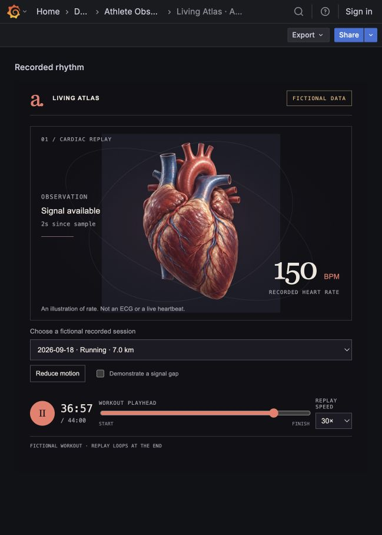
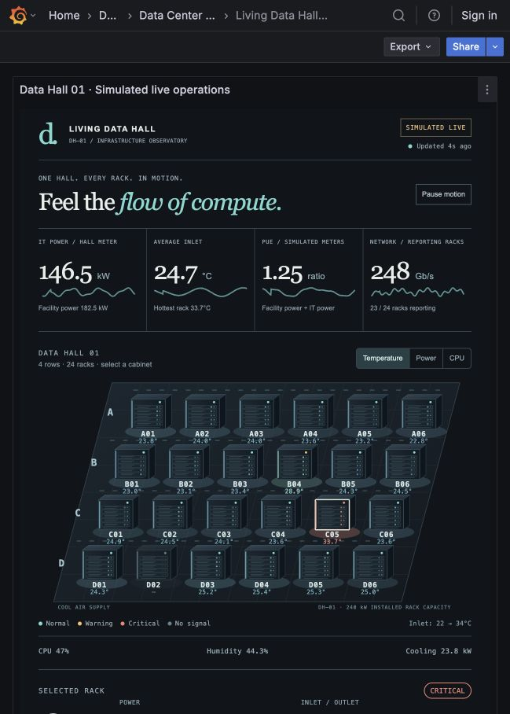
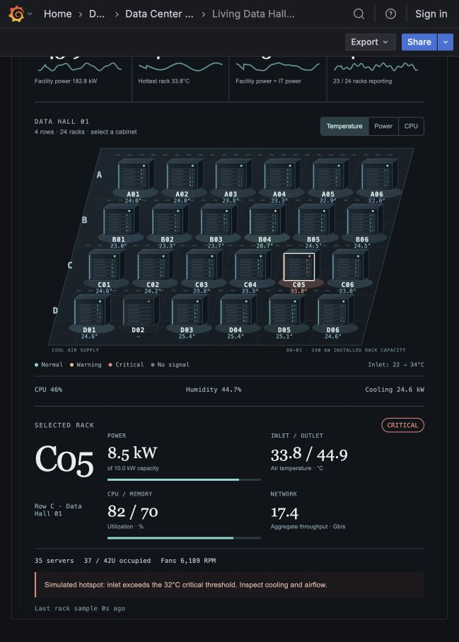
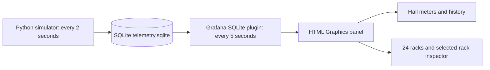

# Grafana Living Visuals

Two animated Grafana experiences: an anatomical heartbeat replay and an interactive data hall with 24 racks. The visuals run natively in the **HTML Graphics** panel and have editable HTML, CSS, and JavaScript sources.

**All bundled readings are fictional or simulated.** No real health data, production infrastructure, credentials, or running databases are included.

## The two visuals

| Visual | What moves | What you can inspect |
| --- | --- | --- |
| Anatomical heartbeat | A two-part pulse follows the recorded BPM | Eight fictional workouts; play/pause, scrubber, replay speed, reduced motion, and a missing-signal demonstration |
| Living Data Hall | Rack LEDs follow CPU activity; cooling paths move; cabinet colors reflect the selected metric | 24 racks in four rows; power, inlet/outlet temperature, CPU, memory, network, fans, inventory, hall meters, PUE, and freshness |

### Anatomical heartbeat



The heart pulses at the BPM of the selected fictional workout sample. The playhead, session picker, and replay speed explore the recorded timeline. The signal indicator reports how old the selected sample is within that timeline. This is an illustration of heart rate, not an ECG, diagnostic image, or live health measurement.

### Living Data Hall



One simulated hall, **DH-01**, contains 24 racks arranged in rows A–D, with six racks per row. The four headline cards show IT power, average inlet temperature, PUE, and aggregate network throughput. Switch the rack color metric between temperature, power, and CPU; select a cabinet to inspect its readings.

<details>
<summary>View the selected-rack inspector: C05 hotspot example</summary>



</details>

These are screenshots of the running local Grafana dashboards, captured on September 19, 2026. The still images show a moment in time; the installed panels animate and their values change during playback or polling. Overview and detail captures were taken at different instants.

## Data sources and ingestion

| | Heartbeat replay | Data hall operations |
| --- | --- | --- |
| Original data | Eight fictional workouts in [`data/heartbeat-demo.json`](data/heartbeat-demo.json) | Synthetic rack and hall readings generated by [`scripts/simulate_data_hall.py`](scripts/simulate_data_hall.py) |
| Storage | Samples embedded in the exported dashboard JSON | Local SQLite database, default `runtime/telemetry.sqlite` |
| Grafana data source | None; samples are HTML Graphics custom properties | SQLite plugin, `frser-sqlite-datasource`; data source **Data Hall · SIMULATED LIVE**, UID `living-data-hall-sim` |
| How updates arrive | The browser selects samples as the replay playhead advances | Python writes every **2 seconds**; Grafana queries every **5 seconds** |
| Visualization | HTML Graphics panel, `gapit-htmlgraphics-panel` | HTML Graphics panel, `gapit-htmlgraphics-panel` |

### Heartbeat: bundled samples → replay

1. Each fictional workout stores its date, activity, distance, duration, and heart-rate samples shaped as `{ "t": seconds_into_workout, "bpm": beats_per_minute }`.
2. [`scripts/build_dashboards.py`](scripts/build_dashboards.py) embeds those samples and the anatomical JPG into [`dashboards/living-atlas-heartbeat.json`](dashboards/living-atlas-heartbeat.json). Importing the dashboard supplies everything the panel needs; no database, wearable API, or external image server is queried.
3. The panel reads the embedded workouts through `htmlGraphics.customProperties`. At each playhead position, it selects the most recent valid sample at or before that point, provided it is no more than **30 recorded seconds** old.
4. A browser animation loop scales the image using a two-part pulse at the selected BPM. **30× replay advances the workout timeline 30 times faster; it does not multiply the displayed heartbeat rate by 30.**

Pause, reduced motion, and missing or invalid samples stop the pulse. The “Demonstrate a signal gap” control intentionally removes the current signal; the panel displays a dash instead of inventing a rate.

### Data hall: simulator → SQLite → Grafana queries → panel



The simulator uses time-based sine and cosine functions to generate smoothly changing, explicitly synthetic measurements. It adds three intentional scenarios: **B04 is warm**, **C05 is a hotspot**, and **D02 has no rack telemetry**. No physical sensor, server, PDU, BMS, or DCIM system is connected.

Every two seconds, one SQLite transaction replaces the current rack and hall snapshots, appends a hall-history sample, and deletes history older than 15 minutes. SQLite uses write-ahead logging (WAL), allowing Grafana to read while the simulator writes. The simulator is the ingestion process; Grafana polls the stored data through its server-side SQLite plugin.

| Query | Table and selection | What reaches the panel |
| --- | --- | --- |
| A | `SELECT * FROM racks ORDER BY row_id, position` | 24 rack identities, locations, status, sensor values, capacity, inventory, and timestamps |
| B | `SELECT * FROM hall WHERE hall_id='DH-01'` | One hall snapshot: independent power meters, PUE, thermal summary, reporting count, humidity, cooling, and timestamp |
| C | `hall_history`, ordered by `sampled_at_ms` | Up to 15 minutes of IT power, average inlet temperature, PUE, and network samples for the sparklines |

The installer configures the SQLite data source with `mode=ro` and `attachLimit=0`. Grafana must be able to read the database on **its own server filesystem**. Query results become data frames A, B, and C; the panel's `onRender` handler updates the values, chart paths, cabinet colors, and animation settings. Polling supplies measurements; CSS animation runs between polls.

`sampled_at_ms` and `last_seen_ms` are Unix timestamps in **milliseconds**, kept as numeric table fields. `sampled_at_ms` identifies the snapshot time; `last_seen_ms` records the last valid rack observation. The panel compares these with the browser clock. The `synthetic=1` marker identifies demo rows.

## What the data hall readings represent

| Reading | Unit | Meaning in this demo |
| --- | --- | --- |
| IT power / facility power | kW | Separate simulated hall meters. Facility power includes IT load, cooling, and other overhead. The IT meter includes D02's load even when that rack's telemetry is unavailable. |
| PUE | Ratio | Facility power divided by IT power from the same simulated snapshot. |
| Rack power / capacity | kW | Current simulated rack load against a configured **10 kW per rack**; 24 racks give **240 kW installed capacity**. |
| Inlet / outlet temperature | °C | Simulated air temperatures entering and leaving a rack. The hall average and hottest value use reporting racks. |
| CPU / memory | % | Simulated utilization for the selected rack. The hall CPU summary is the unweighted mean of reporting rack CPU values. |
| Network | Gb/s | Simulated aggregate throughput per rack; the hall card sums the 23 reporting racks. These are rates, not accumulated byte counters. |
| Cooling / humidity | kW / % relative humidity | Synthetic hall cooling demand and room humidity. Cooling contributes to facility power. |
| Fans / inventory | RPM / count / U | Simulated rack fan speed, server count, and occupied rack units out of a 42U cabinet. Inventory remains visible if sensor readings disappear. |

Cabinet color encodes the selected metric. Activity-light timing follows CPU utilization, and moving cooling paths suggest airflow. These visual effects illustrate the readings; they do not reconstruct actual packets, fan rotations, or airflow physics.

**Status and freshness:** the demonstration uses inlet temperatures of **28°C** for warning and **32°C** for critical. These are configurable demo choices, not operational recommendations. D02 keeps its inventory and old last-seen timestamp, while its sensor readings are null and its activity stops; missing values are never converted to zero. Rack samples older than 30 seconds are treated as unavailable. If the hall sample is older than 20 seconds, or a query fails after data has loaded, the feed is flagged stale and animation pauses. Last-known hall values retain a visible stale indication. “Pause motion” affects animation only; queries continue refreshing.

For real monitoring, replace the simulator with a collector or adapt queries from Prometheus, SNMP-derived metrics, a DCIM/BMS API, or a SQL telemetry store. Preserve rack IDs, units, measurement timestamps, null values, and independent hall meters. Those are future integration paths, not connections included here; see the [data-source exploration](docs/data-source-exploration.md) and [field contract](docs/architecture.md).

## Run with an existing Grafana

The checked-in exports were verified with Grafana **12.1.1**, HTML Graphics **2.2.3**, and the SQLite data source **4.0.6**. Python **3.10+** runs the simulator and build tools without additional packages. Node.js is only needed for JavaScript syntax checks.

1. Clone this repository and rebuild the exports:

   ```sh
   git clone https://github.com/sivalinb/grafana-living-visuals.git
   cd grafana-living-visuals
   python3 scripts/build_dashboards.py
   ```

2. Start the simulator and keep this terminal running:

   ```sh
   python3 scripts/simulate_data_hall.py
   ```

3. In another terminal, install the plugins, data source, and dashboards. Substitute your Grafana URL and admin username. The password is prompted without echo:

   ```sh
   python3 scripts/install_dashboards.py \
     --url http://127.0.0.1:3030 \
     --user YOUR_GRAFANA_ADMIN \
     --db "$PWD/runtime/telemetry.sqlite" \
     --install-plugins
   ```

   The installer prints the dashboard links and groups them in **Living Visuals**. It leaves existing dashboards intact unless `--overwrite` is provided. It refuses to repoint a conflicting data source. Existing plugin versions are reused.

   For a Grafana service account, set `GRAFANA_TOKEN` in your local environment and omit `--user`. Plugin installation requires server-admin permissions; install the plugins separately if the service account cannot do that. Credentials are never written into dashboards or committed configuration.

For Docker or remote Grafana, `--db` must be the path **inside the Grafana server's filesystem**, with access to the simulator database and its SQLite WAL/SHM sidecars. The host path alone is insufficient. The SQLite plugin runs on the server; the browser does not read the file.

The heartbeat can also be imported alone from `dashboards/living-atlas-heartbeat.json`; it needs HTML Graphics but no data source. For the data hall, use the installer or create the data source with UID `living-data-hall-sim`, then import `dashboards/living-data-hall.json`.

## Explore the implementation

- [Data-source exploration and integration options](docs/data-source-exploration.md)
- [Data contract, freshness, and animation design](docs/architecture.md)
- [Validation and observed behavior](docs/validation.md)
- [Asset provenance](docs/provenance.md)

```text
assets/                     Anatomical heart artwork
docs/images/                Screenshots captured from the running Grafana dashboards
data/heartbeat-demo.json     Eight explicitly fictional recorded sessions
panels/heartbeat/           Editable HTML, CSS, JS, and dashboard template
panels/data-hall/           Editable rack map, rendering logic, and template
dashboards/                Generated, directly importable Grafana JSON
scripts/                   Portable builder, simulator, and API installer
tests/                     Data, build, and packaging checks
runtime/                   Local generated telemetry; ignored by Git
```

## Verify changes

```sh
python3 scripts/build_dashboards.py --check
python3 -m unittest discover -s tests -v
node --check panels/heartbeat/on-init.js
node --check panels/data-hall/on-init.js
```

Edit a panel's sources, rebuild the JSON, then import the updated export or run the installer with `--overwrite`. The local simulator is a foreground process, not a startup service. Stop it with Ctrl-C; Grafana retains the last snapshot and reports the feed as stale.
