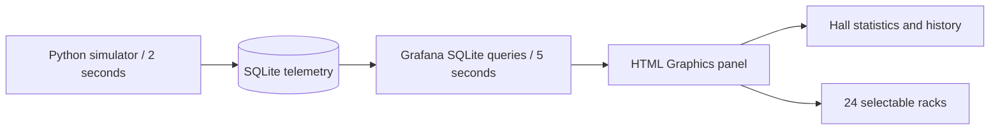

# Data-source exploration

## What was available

The inspected local Grafana instance was version 12.1.1. Its existing data sources were two SQLite integrations for the separate Athlete Observatory project. No data-center monitoring endpoint was configured. The requested first version therefore uses explicitly labeled simulated live readings.

The heartbeat replays eight fictional sessions bundled with the original Living Atlas visual. Its artwork and samples are embedded in the dashboard JSON, so it has no live data-source dependency.

The data hall uses a separate, continuously updated SQLite database through Grafana's installed `frser-sqlite-datasource` plugin. This exercises the actual Grafana query and panel-render lifecycle instead of generating changing values only inside the browser.

## Implemented path

The data source uses `mode=ro` and `attachLimit=0`. The database must be on a filesystem Grafana can access. These are server-side reads, not browser requests. See the [SQLite plugin documentation](https://grafana.com/grafana/plugins/frser-sqlite-datasource/).

| Query | Dataset | Purpose |
| --- | --- | --- |
| A | `racks`, ordered by row and position | Current rack metrics, status, inventory, and last-seen timestamps |
| B | `hall` for `DH-01` | Hall power meters, PUE, thermal summary, reporting count, and freshness |
| C | `hall_history`, ordered by sample timestamp | Up to 15 minutes of sparkline history |

Queries return tables. Timestamp fields deliberately remain numeric **milliseconds**, and `timeColumns` is empty. The panel compares them with `Date.now()`. If switching to the SQLite plugin's time-column conversion, adapt units: that plugin interprets numeric time values as Unix **seconds**. [SQLite time-column documentation](https://grafana.com/grafana/plugins/frser-sqlite-datasource/)

## Paths for production telemetry

These are integration candidates, not additional connections implemented in this repository.

| Existing system | Possible Grafana path | Work required for this visual |
| --- | --- | --- |
| Prometheus or a compatible metrics store | Grafana's built-in Prometheus data source | Normalize labels such as hall, row, and rack; query current values and sample timestamps; transform the result to the panel contract |
| Network equipment exposing SNMP | Prometheus SNMP exporter, then the Prometheus data source | Configure device modules/OIDs and units, map devices to rack IDs, and preserve scrape failure/staleness information |
| DCIM or BMS with REST/JSON endpoints | A supported API integration, potentially the Infinity data source | Configure authentication server-side, validate polling limits, and map JSON fields and timestamps to racks |
| An existing SQL telemetry warehouse | Its supported Grafana SQL data source | Implement three equivalent result tables, retain nulls, and preserve independent hall-meter measurements |

[Grafana Prometheus documentation](https://grafana.com/docs/grafana/latest/datasources/prometheus/) · [Prometheus SNMP exporter](https://github.com/prometheus/snmp_exporter) · [Grafana Infinity documentation](https://grafana.com/docs/plugins/yesoreyeram-infinity-datasource/latest/)

## Data decisions

- A rack ID is a stable location identifier. Hostnames, serial numbers, and exporter instances should map to it rather than becoming the visual's primary identity.
- Power uses kW, temperatures use °C, network throughput uses Gb/s, and CPU/memory use percentages. Counter-based network metrics need a rate calculation before entering this contract.
- `sampled_at_ms` identifies collection time. `last_seen_ms` identifies the last valid rack observation. A newly polled API response does not make an old measurement fresh.
- Null values are unavailable data, not zero. Rack D02 demonstrates this with stopped LEDs and empty sensor readouts.
- The hall IT and facility power readings represent independent meters. An offline rack's telemetry does not imply its electrical load vanished. PUE is facility power divided by IT power using the same collection instant.
- Warning at 28°C and critical at 32°C are demo settings. Replace them with site-specific limits when connecting real equipment.
- Cabinet coloring, LED activity, and cooling animation are illustrative encodings. They do not reconstruct individual packets, electrical waveforms, or airflow physics.

## Connection checklist

To replace simulation, identify the real data source, the rack inventory, the metric-to-rack mapping, units, measurement timestamps, expected collection interval, and missing-data behavior. Keep credentials in Grafana's data-source configuration. Adapt the queries or add a normalization layer to satisfy the [panel contract](architecture.md), then remove the simulation badge only after real readings have been verified.
